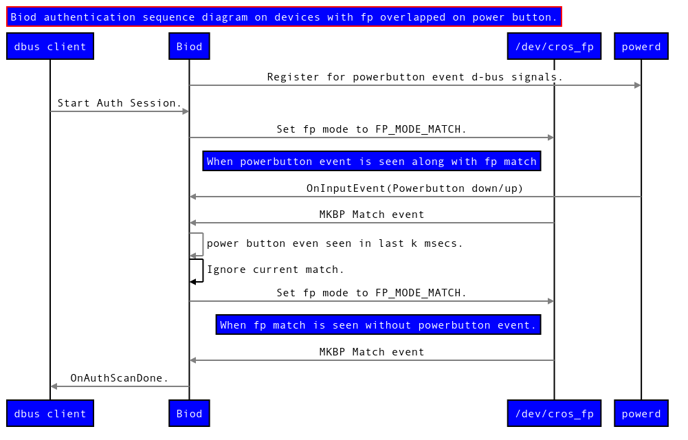

# Biod: Biometrics Daemon

## ABOUT

Biod (Biometrics Daemon) is a daemon for enrolling, authenticating and managing
biometrics data for faster unlocking. It manages all biometric sensors for all
users of the device.

## KEYWORDS

Record - a specific piece of biometric data that a user registers along with its
metadata.

Enroll - the act of registering a record.

EnrollSession - the session during which enrolling of a record happens.

Authenticate - the act of checking a new piece of biometric data against stored
records.

AuthSession - the session during which authenticating a new piece of biometric
data against stored records happens.

BiometricsManager - manager for a piece of device/hardware/sensor for collecting
a specific type of biometric data. Each BiometricsManager is in charge of
storing the records that it enrolled.

## STORAGE

The records are stored under the directory:
/home/root/[hash_of_user_id]/biod/[name_of_biometrics_manager]/
with the file name:
Record[UUID].

UUID has the form of XXXXXXXX_XXXX_XXXX_XXXX_XXXXXXXXXXXX where X represents a
lowercase hex digit. UUID is a 128-bit random number generated with guid, so it
will highly unlikely repeat. '_' are used instead of '-' because this UUID is
used in biod D-bus object paths, which do not allow '-'.

Each record file is stored in JSON format, and contains one record and its
record id and label.

## HARDWARE

### CrosFpBiometric

CrosFpBiometric (fingerprint MCU) runs the firmware for image capture, matching
and enrollment. Biod (`cros_fp_biometrics_manager.cc`) interacts with the MCU
by doing system calls on `/dev/cros_fp`.

#### Authentication

On receiving an Authentication request, biod makes a ioctl call to put the MCU
in FP_MODE_MATCH. It then listens for MBKP events from the MCU. On receiving
the event, based on the result, biod either reports success or failure to the
D-bus client (typically Chrome).

Things get little complicated on devices with fingerprint overlapped on
power button. On these devices, we need to be careful not to interpret user's
interaction with power button as an intent to authenticate via fingerprint. To
avoid such scenarios, we ignore fingerprint matches if we have seen a power
button event in last few milliseconds. To achieve this, biod keeps track of
power button events (`power_button_filter.cc`) by listening to d-bus events
advertised by powerd (`power_manager.cc`). The sequence diagram below gives a
sequence of events on devices with fingerprint overlapped on power button.

#### Enrollment

TODO

## CHROME

Biod communicates with Chrome via D-bus messages. Chrome provides the graphical
interface for users to enroll new biometric data and manage their own
records. Chrome is also responsible for the visual display during
authentication.

## LOGIN MANAGER

When a user logs in or biod starts, biod will ask login manager for a list of
currently logged-in users, and load from storage the records of the newly
logged-in users.

When a user logs out, all users log out at the same time, biod receives a
signal from login manager and remove all records in the memory.

## CRYPTOHOME

Because the records are stored in per user stateful under /home/root/
[hash_of_user_id], they are naturally encrypted by cryptohome. Records are
encrypted when the users log out and decrypted when the users log in. Cryptohome
provides a layer of security to biod.

## TESTING TOOLS

### biod_client_tool

biod_client_tool provides the interface to fake the behavior of a biometrics
client, for example, a lock screen or a biometric enrollment app. It can be used
to test biod and biometric sensors.
