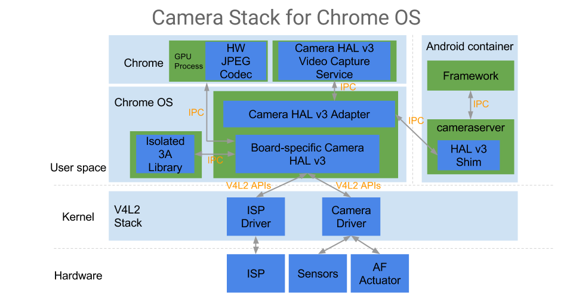

# ChromeOS Platform Camera

The repository hosts the core ChromeOS platform camera components, including:

-   1P Camera Hardware Abstraction Layers (HALs) of different platforms
-   Common dependencies and libraries needed by the camera HALs
-   [Camera HAL adapter](hal_adapter) to interface with all the camera clients
    through Mojo IPC
-   [Camera conformance test suite](camera3_test) for the camera HALs

[TOC]

## System Overview

The camera service provider on ChromeOS is a standalone process that can be
divided into two part:

-   **Platform-specific camera HAL** that interfaces with the kernel drivers and
    provide all the camera functions through the
    [**Android camera HAL v3 APIs**](android/header_files/include/hardware/libhardware/include/hardware/camera3.h).
-   **Camera HAL v3 adapter** that provides Mojo IPC interface for all the
    clients on ChromeOS to access the platform-specific camera HAL.

Currently we have two major camera clients on ChromeOS: *Chrome browser* and
*Android*. All the clients connect to the camera HAL adapter through the
[**Camera Module Mojo IPC interface**](mojo/camera_common.mojom) and the
[**Camera Device Mojo IPC interface**](mojo/camera3.mojom) to access camera
functions. The Mojo IPC interface is very similar to the Android camera HAL v3
APIs.

### Camera 3A Library Sandboxing

Usually the platform-specific camera HAL is accompanied with a proprietary
camera 3A (auto focus, auto exposure, and auto white-balance) library that
provides the algorithms to control the camera subsystem for capturing high
quality images. We isolate the camera 3A library in a separated sandboxed
process for security consideration. The camera HAL accesses the camera 3A
library through the
[**Camera Algorithm Mojo IPC interface**](mojo/algorithm/camera_algorithm.mojom).

### Encoding / Decoding JPEG images

The camera HAL needs to generate JPEG images when processing still shot
requests. On ChromeOS the JPEG codec service, if supported on the platform, is
provided by the GPU process in Chrome browser. We provide libraries to handle
JPEG encoding and decoding: On platform that supports hardware-accelerated JPEG
encoder/decoder, the JPEG libraries connect to the Chrome GPU process through
Mojo IPC channels to encode/decode JPEG images; otherwise the JPEG
encoding/decoding is done through software.

## Adding a New Camera HAL

### Creating a Camera HAL for ChromeOS

The ChromeOS camera HAL are essentially the following shared libraries, plus and
dependencies required by them:

-   `camera_hal.so` that provides the
    [**camera HAL interface**](android/header_files/include/hardware/libhardware/include/hardware/camera_common.h).
    This is very similar to a regular Android camera HAL. *(Required)*
-   `libcam_algo.so` that provides the
    [**camera algorithm interface**](include/cros-camera/camera_algorithm.h) for
    the isolated camera 3A library. *(Required if the camera HAL requires 3A
    library to work)*.

We provide the following packages that are required to build the camera HAL:

-   `chromeos-base/cros-camera-android-deps`

    A package that installs all the necessary Android headers files and
    libraries required by the camera HAL.

-   `chromeos-base/cros-camera-libs`

    A package that provides all the base functionality and libraries for running
    the camera HAL stack. Check the [header files](include/cros-camera) for the
    functions provided. Some important ones are:

    1.  Functions to access the isolated camera 3A library if the camera HAL
        requires it to work. See the
        [APIs](include/cros-camera/camera_algorithm.h) for more details.

    2.  A replacement for Android gralloc. The library provides
        [APIs](include/cros-camera/camera_buffer_manager.h) to import and map
        buffer handles received in capture requests.

    3.  JPEG [decoder](include/cros-camera/jpeg_decode_accelerator.h) and
        [encoder](include/cros-camera/jpeg_encode_accelerator.h) APIs that adapt
        to either software or hardware-accelerated implementations based on the
        platform capability.

-   `media-libs/libsync`

    A port of the Android `libsync`.

### Uploading the Camera HAL Source Code

To add a new camera HAL for a new platform, one needs to upload the source code
of the camera HAL to the camera HAL directory ([1P](hal),
[3P](https://source.chromium.org/chromiumos/chromiumos/codesearch/+/main:src/platform/camera/hal/)).

Examples:
[**Intel camera HAL**](https://source.chromium.org/chromiumos/chromiumos/codesearch/+/main:src/platform/camera/hal/intel/),
[**USB camera HAL**](hal/usb).

### Adding ebuild Files

After the camera HAL source code is uploaded, one needs to add corresponding
packages to build and install the camera HAL and the required libraries. On
ChromeOS, packages are managed by ebuild files. The following ebuild files are
required for a new camera HAL:

-   A ebuild file for the newly added camera HAL. The ebuild file is used to
    build and install the platform specific camera HAL and the camera algorithm
    (`libcam_algo.so`) shared libraries into the board sysroot. To integrate the
    camera HAL into the OS image, a `virtual/cros-camera-hal` ebuild that
    includes the newly added camera HAL as `RDEPEND` is required in the
    baseboard or board overlay.

    -   Camera HAL ebuild examples: [**Intel Kabylake camera HAL**],
        [**USB camera HAL**]

    -   Camera HAL virtual ebuild example:
        [**Intel Kabylake camera HAL virtual package**]

-   For board-specific camera HAL config files, we have the
    `virtual/cros-camera-hal-configs` ebuild. One can add a new ebuild to
    install the board-specific camera HAL config files, and list the new ebuild
    as `RDEPEND` of the virtual ebuild.

    -   Camera HAL config ebuild example:
        [**Intel Kabylake camera HAL configs**]

    -   Camera HAL config virtual ebuild example:
        [**Intel Kabylake camera HAL configs virtual package**]

[**Intel Kabylake camera HAL**]: https://chromium.googlesource.com/chromiumos/overlays/board-overlays/+/HEAD/chipset-kbl/media-libs/cros-camera-hal-intel-ipu3/
[**USB camera HAL**]: https://chromium.googlesource.com/chromiumos/overlays/chromiumos-overlay/+/HEAD/media-libs/cros-camera-hal-usb/
[**Intel Kabylake camera HAL virtual package**]: https://chromium.googlesource.com/chromiumos/overlays/board-overlays/+/HEAD/baseboard-poppy/virtual/cros-camera-hal/
[**Intel Kabylake camera HAL configs**]: https://chromium.googlesource.com/chromiumos/overlays/board-overlays/+/HEAD/baseboard-poppy/media-libs/cros-camera-hal-configs-poppy/
[**Intel Kabylake camera HAL configs virtual package**]: https://chromium.googlesource.com/chromiumos/overlays/board-overlays/+/HEAD/baseboard-poppy/virtual/cros-camera-hal-configs/
