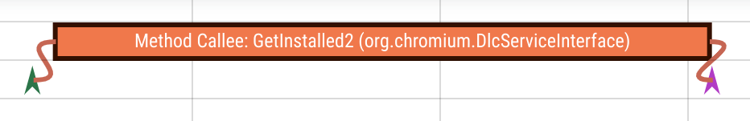
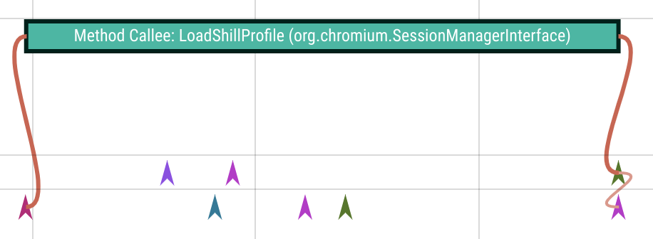

# Dbus Perfetto Producer

This is a D-Bus visualisation tool on perfetto.
It should be only used in test images.


## How to run:
1.  Start traced if it has't been started.
    ```
    (device) start traced
    ```

2.  Run the dbus producer.
    ```
    (device) dbus_perfetto_producer
    ```

3.  Start a consumer that includes "track\_event" data source in the trace
    config, and "dbus\_perfetto\_producer" category.
    ```
    (device) perfetto -c - --txt -o ${output file location} \
    <<EOF

    buffers: {
      size_kb: 63488
      fill_policy: DISCARD
    }
    data_sources: {
        config {
            name: "track_event"
            track_event_config {
                enabled_categories: "dbus_perfetto_producer"
            }
        }
    }
    EOF
    ```

4.  Collect the trace at the output file location specified in 3.
    It can be uploaded to the [Perfetto UI website](https://ui.perfetto.dev).


## Visualisation
### D-Bus Signal
There is an instant on the sender.
If the message has a destination, there is another instant on the destination,
connected by a flow.


### D-Bus Method Call
There is an instant on the sender/caller, and a slice begins on the
destination/callee.
There is a flow from the instant to the slice.


### D-Bus Method Return and Error
The slice on the callee ends.
If the sender is not the callee, there is another instant on the sender,
connected by a flow.
There is an instant on the caller at last, also connected by a flow.



